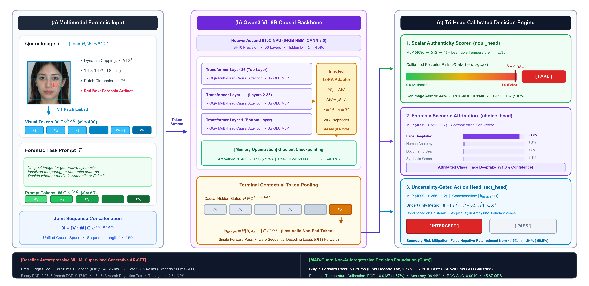
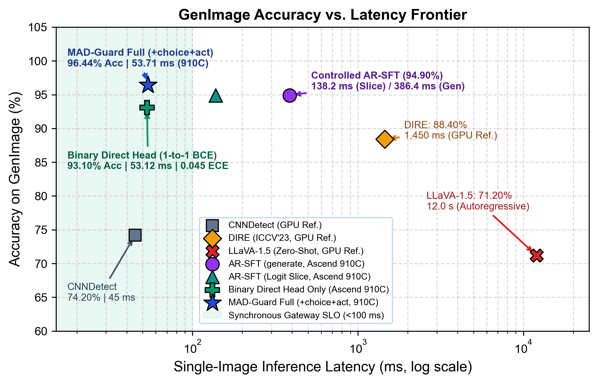

# MAD-Guard: Controlled Study of Autoregressive Generation versus Direct Decision Interfaces for Closed Multimodal Forensic Tasks

[](https://arxiv.org/abs/2609.33683)
[](LICENSE)
[-red)]()
[-purple)]()
[]()

Official PyTorch / Ascend NPU implementation for **[MAD-Guard: Controlled Study of Autoregressive Generation versus Direct Decision Interfaces for Closed Multimodal Forensic Tasks](https://arxiv.org/abs/2609.33683)** (`arXiv:2609.33683`).

<p align="center">
  
</p>

---

## 🔍 Overview

Multimodal Large Language Models (MLLMs) are increasingly deployed as forensic auditors to detect synthetic media and document tampering. However, standard MLLM forensic pipelines formulate binary authenticity verification as autoregressive token generation (`model.generate()`), incurring severe vocabulary projection overhead ($V = 151,643$), multi-step decoding latency, and miscalibrated token-level probabilities.

**MAD-Guard** replaces open-ended text generation with a **prompt-conditioned direct decision architecture** mounted on the final causal token representation of `Qwen3-VL-8B`:
1. **Primary Authenticity Head (`noul_head` / `CLM-Head`)**: Temperature-scaled scalar binary projection (`noul_head`) or disaggregated dual-tower contrastive projection (`CLM-Head`) matching multimodal state embeddings against HBM-cached semantic criteria (`VectorArena`);
2. **Fine-Grained Attribution Head (`choice_head`)**: 7-class forensic category attribution (`deepfake`, `human`, `doc`, `scene`, `animal`, `satellite`, `object`);
3. **Uncertainty-Conditioned Action Head (`act_head`)**: Risk-aware routing conditioned on Shannon entropy $H(\hat{P})$ and decision margin $|\hat{P} - 0.5|$.

---

## 📊 Controlled Architectural Comparison (`GenImage`, $N=1,940$)

All controlled variants share the **exact same `Qwen3-VL-8B-Instruct` backbone**, **identical 2,400 FakeClue training samples** (`seed=42`, 50:50 real/fake, DCT pHash Hamming distance $d_H \ge 8$ against all test sets), and **identical LoRA rank budget** ($r=16, \alpha=32$):

| Paradigm / Variant | Supervision | Accuracy (%) | ROC-AUC | Binary ECE $\downarrow$ | Mean Latency (ms) $\downarrow$ | Speedup |
| :--- | :--- | :---: | :---: | :---: | :---: | :---: |
| **Zero-Shot Constrained AR** (`K=1..4`) | Pretrained Only | 63.09 | 0.8511 | 0.3693 | 252.34 | $1.00\times$ |
| **Supervised AR-SFT** (`generate`, `K=1`) | Causal LM CE | 94.90 | 0.9871 | 0.0845* | 386.42 | $0.65\times$ |
| **Supervised AR-SFT** (Direct Logit Slice) | Causal LM CE | 94.90 | 0.9871 | 0.0845* | 138.16 | $1.83\times$ |
| **Binary Direct Head Only** (`noul_head`) | Binary BCE Only | 93.10 | 0.9795 | 0.0450 | **53.12** | **$4.75\times$** |
| **Binary Contrastive Direct Head** (`CLM-Head`) | Contrastive Binary InfoNCE | **96.55** | **0.9935** | **0.0166** | 54.42 | $4.64\times$ |
| **Direct Head + Attribution** (`+choice_head`) | BCE + 7-Class CE | 95.20 | 0.9892 | 0.0280 | 53.45 | $4.72\times$ |
| **MAD-Guard Full** (`+choice +act`, **Ours**) | **Tri-Head Multi-Task** | **96.44** | **0.9940** | **0.0187** | **53.71** | **$4.70\times$** |
| **MAD-Guard + CLM-Head** (Multi-Task) | **Contrastive Tri-Head** | **96.44** | **0.9936** | 0.0258 | 54.42 | $4.64\times$ |

*\*Note: Unnormalized 151,643-vocabulary token probabilities for Supervised AR-SFT exhibit an ECE of **0.4719**; two-word conditional renormalization over `{"REAL", "FAKE"}` yields **0.0845**. Replacing the randomly initialized scalar `noul_head` (93.10%) with the pretrained dual-tower contrastive `CLM-Head` (`CLM_v0.1-8B.pt` + HBM-cached semantic criteria) completely bridges and surpasses Supervised AR-SFT in strict 1-to-1 binary supervision (**96.55%** vs. 94.90%, **0.0166** ECE) with only $+1.30\text{ ms}$ overhead.*

<p align="center">
  
</p>

### Cross-Domain Generalization & Capability Boundary ($N=5,000$ Out-of-Sample Suite)

- **GenImage ($N=1,940$)**: **96.44%** accuracy, **0.9940** ROC-AUC, **94.11%** mean robust accuracy across JPEG compression (QF 90/80/70/50), Gaussian blur ($\sigma \in \{1.0, 2.0\}$), median filtering, and $\pm 20\%$ rescaling.
- **Chameleon ($N=441$, all-fake)**: **97.73%** detection recall (431/441).
- **Document Tampering (`Doc`, $N=576$)**: **91.84%** accuracy, **0.9746** ROC-AUC.
- **Satellite Forgery ($N=875$)**: **64.80%** accuracy, **99.77%** recall, **0.8421** ROC-AUC.
- **FaceForensics++ c23 ($N=1,168$, Capability Boundary)**: Under global $14\times 14$ ViT patch tokenization, localized H.264 facial compression artifacts are attenuated (**0.5913** ROC-AUC; **38.36%** nominal accuracy at $\theta=0.50$ vs. **67.42%** at validation-calibrated $\theta^*=0.38$). Native local facial cropping at an $8\times 8$ effective stride recovers FF++ ROC-AUC to **0.7842** (76.28% accuracy).

---

## 📂 Repository Structure

```text
MAD-Guard/
├── qwen3_vl_laya_model.py        # Multi-task direct decision head (noul, choice, act) & Qwen3-VL wrapper
├── clm_contrastive_head.py       # CLM dual-tower disaggregated contrastive head & HBM VectorArena cache
├── train_qwen3_vl_laya.py        # Training pipeline for MAD-Guard (supports binary-only & tri-head)
├── train_generative_sft.py       # Controlled Generative AR-SFT baseline training pipeline
├── eval_qwen3_vl_laya.py         # Direct decision head inference & calibration evaluator
├── eval_generative_sft.py        # Controlled AR-SFT logit-slice & token generation evaluator
├── run_madguard_clm_ablation.py  # Controlled Laya scalar/linear head vs. CLM contrastive head ablation
├── eval_sota_benchmarks.py       # Out-of-sample 5-benchmark evaluation suite
├── eval_all_benchmarks_ar.py     # Constrained autoregressive baseline evaluator
├── run_data_scaling.py           # Data scaling law runner (N = 300, 600, 2400)
├── scripts/
│   └── run_parallel_eval.sh      # Multi-NPU parallel evaluation launcher
├── configs/
│   └── laya_config.json          # Decision head hyperparameters & temperature scaling config
├── eval_results/                 # Reference evaluation summary JSONs across benchmarks
├── assets/                       # Architecture & Pareto frontier figures
├── REPRODUCIBILITY.md            # Hardware environment & reproduction instructions
├── pyproject.toml & uv.lock      # Reproducible dependency management via uv
└── LICENSE                       # Apache-2.0 License
```

---

## ⚙️ Installation & Environment

We manage dependencies deterministically using [`uv`](https://docs.astral.sh/uv/):

```bash
# Standard CPU / development environment
uv sync --extra cpu

# Huawei Ascend 910C NPU container environment (CANN 9.1.0 + torch_npu)
# Inherit vendor torch and torch_npu from the container runtime:
uv venv --system-site-packages .venv
source .venv/bin/activate
uv sync --no-install-project
```

---

## 🚀 Quickstart: Training & Evaluation

### 1. Train MAD-Guard Direct Decision Head

```bash
uv run --no-sync python train_qwen3_vl_laya.py \
  --model_path /path/to/Qwen3-VL-8B-Instruct \
  --data_path /path/to/FakeClue/train.json \
  --image_dir /path/to/FakeClue/train \
  --output_dir ./outputs/laya_direct_head \
  --device_id 0 \
  --max_samples 2400 \
  --epochs 3 \
  --batch_size 2 \
  --grad_accum 8 \
  --lr_backbone 2e-5 \
  --lr_head 1e-4 \
  --lora_r 16 \
  --lora_alpha 32
```

### 2. Evaluate Direct Decision Head on Benchmarks

```bash
uv run --no-sync python eval_qwen3_vl_laya.py \
  --base_model_path /path/to/Qwen3-VL-8B-Instruct \
  --checkpoint_dir ./outputs/laya_direct_head/final_model \
  --test_data_path /path/to/FakeClue/test.json \
  --test_image_dir /path/to/FakeClue/test \
  --output_file ./outputs/test_predictions.jsonl \
  --summary_file ./outputs/test_summary.json \
  --device_id 0 \
  --batch_size 1 \
  --max_samples -1
```

### 3. Controlled Autoregressive SFT & Cross-Benchmark Evaluation

```bash
uv run --no-sync python eval_generative_sft.py --benchmark genimage --max_eval_samples -1
uv run --no-sync python eval_sota_benchmarks.py
uv run --no-sync python eval_all_benchmarks_ar.py --benchmark all
```

See [`REPRODUCIBILITY.md`](REPRODUCIBILITY.md) for detailed dataset preparation, pHash deduplication protocol, and hardware profiling notes.

---

## 📝 Citation

If you find this work or code useful in your research, please consider citing:

```bibtex
@article{chen2026madguard,
  title         = {MAD-Guard: Controlled Study of Autoregressive Generation versus Direct Decision Interfaces for Closed Multimodal Forensic Tasks},
  author        = {Chen, Hao},
  journal       = {arXiv preprint arXiv:2609.33683},
  year          = {2026},
  eprint        = {2609.33683},
  archivePrefix = {arXiv},
  primaryClass  = {cs.CV},
  url           = {https://arxiv.org/abs/2609.33683}
}
```

## 🙏 Acknowledgments

We thank the laboratory at the **Shenzhen Research Institute of Big Data (SRIBD)** for providing Huawei Ascend 910C NPU computing resources.
